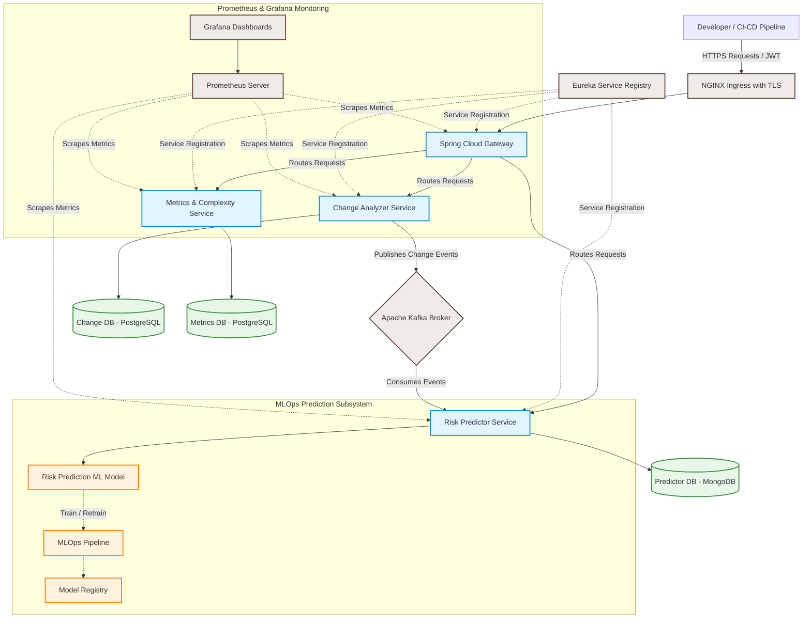

# ImpactFlow

[](https://spring.io/projects/spring-boot)
[](https://kubernetes.io/)
[](https://kafka.apache.org/)
[](https://www.docker.com/)
[](https://github.com/features/actions)
[](https://owasp.org/)

**ImpactFlow** is a cloud-native platform designed to analyze proposed software changes and predict their potential impact and risk prior to deployment. By analyzing component dependencies, code complexity metrics, and historical change patterns, ImpactFlow computes an AI/ML-driven risk score and provides recommendations. This helps development and DevOps teams prevent production incidents, reduce downtime, and deploy with confidence.

---

## 📖 Table of Contents

- [Project Overview](#-project-overview)
- [Key Features](#-key-features)
- [System Architecture](#-system-architecture)
- [MLOps Workflow](#-mlops-workflow)
- [DevSecOps & CI/CD Pipeline](#-devsecops--cicd-pipeline)
- [Directory Structure](#-directory-structure)
- [Getting Started](#-getting-started)
- [Project Team & Governance](#-project-team--governance)

---

## 🔍 Project Overview

In large-scale, distributed microservices architectures, even minor code changes can trigger unexpected cascading failures. Traditional CI/CD pipelines validate code correctness via testing but fail to explicitly assess the system-wide risks and downstream impacts introduced by changes.

ImpactFlow bridges this gap by proactively evaluating:
- **Direct & Indirect Dependencies:** Understanding which services depend on the changed modules.
- **Historical Change Patterns:** Mapping risk based on past failure rates of modified areas.
- **Code Complexity:** Evaluating cognitive load and risk using static analysis metrics.

Based on these dimensions, an AI/ML model predicts a **risk score** and generates actionable recommendations before deployment.

---

## ✨ Key Features

- **Automated Impact Analysis:** Identifies affected modules and downstream services.
- **AI/ML Risk Prediction:** Computes a change risk score using historical data and code complexity.
- **Service Discovery & Gateway Routing:** Dynamic routing and discovery using Eureka and Spring Cloud Gateway.
- **Event-Driven Processing:** Kafka-based change event propagation for asynchronous analysis.
- **Database-per-Service Pattern:** Isolated datastores for services to ensure scalability and decoupling.
- **Robust DevSecOps Pipeline:** Automated testing, SonarQube quality checks, Trivy container scans, and OWASP ZAP dynamic testing.
- **Real-time Monitoring:** Real-time health and performance visualization via Prometheus and Grafana.

---

## 🏗️ System Architecture

ImpactFlow is built on a containerized, cloud-native microservices architecture coordinated within a Kubernetes cluster.

### Architecture Topology



### Component Details
- **Spring Cloud Gateway:** Entry point for API routing, rate limiting, and JWT authentication checks.
- **Eureka Server:** Handles service registration and discovery dynamically.
- **Change Analyzer Service:** Evaluates code commits, file modifications, and dependency graphs.
- **Risk Predictor Service:** Consumes change events from Kafka, interacts with the ML model, and persists risk scores.
- **Metrics & Complexity Service:** Evaluates code health (e.g., McCabe cyclomatic complexity, cognitive complexity).
- **Apache Kafka:** Decouples change ingestion from computationally intensive prediction workflows.

---

## 🤖 MLOps Workflow

The ML system supports continuous integration and retraining to adapt to evolving codebases:

```
[ Data Preparation ] ──> [ Model Training ] ──> [ Model Evaluation & Versioning ]
         ▲                                                       │
         │                                                       ▼
[ Continuous Monitoring ] <── [ Model Retraining ] <── [ Model Deployment ]
```

1. **Data Preparation:** Extracts change metrics, historical commit patterns, and build logs.
2. **Model Training:** Trains classification and regression models to estimate impact depth and risk score.
3. **Versioning & Deployment:** Versions models for reproducibility, deploying them via microservice APIs.
4. **Monitoring:** Prometheus tracks drift in prediction accuracy, triggering alerts for retraining.

---

## 🔒 DevSecOps & CI/CD Pipeline

ImpactFlow enforces modern software quality and security practices at every stage of the lifecycle:

```
[ Developer Commit ] ──> [ Build & Unit Test ] ──> [ Static Analysis (SonarQube) ]
                                                                 │
                                                                 ▼
[ Deploy to K8s via Helm ] <── [ DAST (OWASP ZAP) ] <── [ Trivy Image Scan ]
```

- **Static Application Security Testing (SAST):** Integrated with SonarQube for code-quality checks and linting.
- **Software Composition Analysis (SCA) & Container Scanning:** Trivy scans the Docker images for vulnerable base layers and third-party dependencies.
- **Dynamic Application Security Testing (DAST):** OWASP ZAP evaluates APIs for runtime security flaws (e.g., broken object-level authorization, injection).
- **GitOps-driven Deployments:** Configuration managed using Helm charts and rolled out to Kubernetes using rolling updates.

---

## 📂 Directory Structure

The repository is structured to separate source code, configuration files, test outputs, and documentation:

```
ImpactFlow/
├── src/             # Core source code
│   ├── gateway/     # Spring Cloud Gateway service
│   ├── registry/    # Eureka Service Registry
│   ├── analyzer/    # Change Analyzer Microservice
│   ├── predictor/   # Risk Predictor Microservice
│   └── ML-model/    # Python-based ML training and prediction scripts
├── docs/            # Architecture blueprints, API contracts, and guides
├── reports/         # Security vulnerability, SonarQube, and test reports
├── results/         # Model metrics, outputs, and validation charts
└── data/            # Datasets for model training and testing
```

---

## 🚀 Getting Started

*(Detailed deployment and setup instructions will be updated here as service components are populated.)*

### Prerequisites
- Java 17+ (JDK)
- Docker & Kubernetes (Minikube or Kind)
- Apache Kafka
- Python 3.9+ (for ML scripts)
- Helm

---

## 👥 Project Team & Governance

### Team Details

| Roll Number | Name | Role |
|:---|:---|:---|
| **2420030045** | Susmitha | Developer / Team Member |
| **2420030477** | N. Amrutha Lekha | Developer / Team Member |
| **2420030597** | G Samhitha | Developer / Team Member |
| **2420030752** | Manvitha Reddy | Developer / Team Member |

### Project Supervision
- **Guide:** SWAPNA REDDY

---
*Developed as part of the Advanced Software Engineering & DevSecOps Course curriculum.*
